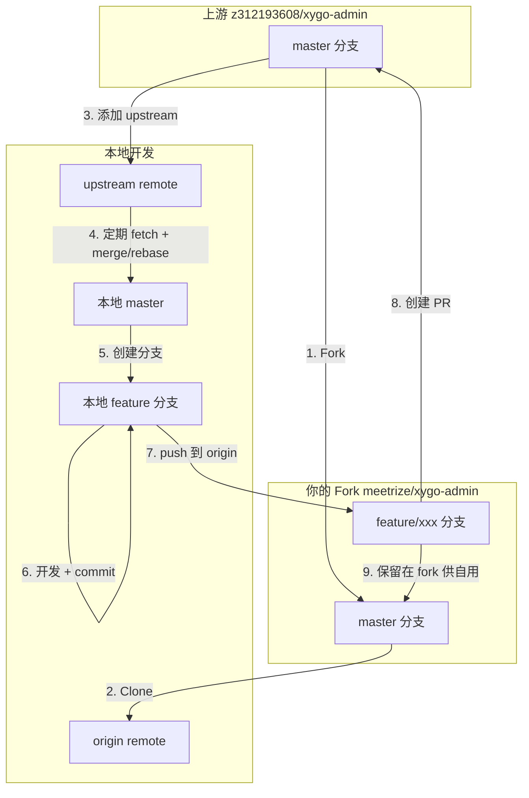

# xygo-admin 开源协作开发工作流

本文档说明如何在 [meetrize/xygo-admin](https://github.com/meetrize/xygo-admin) 上开发，同时与上游 [z312193608/xygo-admin](https://github.com/z312193608/xygo-admin) 保持同步，并将改动贡献回上游。

---

## 整体思路

开源协作里通常有三份代码：

| 角色 | 仓库 | 说明 |
|------|------|------|
| **Upstream（上游）** | [z312193608/xygo-admin](https://github.com/z312193608/xygo-admin) | 原作者仓库，只读同步 |
| **Origin（你的 Fork）** | [meetrize/xygo-admin](https://github.com/meetrize/xygo-admin) | 你的 GitHub Fork，可 push |
| **Local（本地）** | `/Volumes/SSD4T/pro/xygo-admin` | 本地开发目录 |

你要同时做到三件事：

1. **跟上游同步** → 从 `upstream` 拉最新代码
2. **做自己的开发** → 在独立分支上改，不污染主分支
3. **贡献回上游** → 把改动通过 Pull Request 提交到上游

---

## 工作流程图



---

## 第一步：克隆 Fork 并配置 Remote

你已完成 Fork，仓库地址为：**https://github.com/meetrize/xygo-admin**

### 1. 克隆你的 Fork 到本地

```bash
git clone https://github.com/meetrize/xygo-admin.git /Volumes/SSD4T/pro/xygo-admin
cd /Volumes/SSD4T/pro/xygo-admin
```

### 2. 添加上游 remote

```bash
# origin 已指向你的 fork：meetrize/xygo-admin
# 额外添加上游仓库，命名为 upstream
git remote add upstream https://github.com/z312193608/xygo-admin.git

# 验证
git remote -v
# origin    https://github.com/meetrize/xygo-admin.git (fetch)
# origin    https://github.com/meetrize/xygo-admin.git (push)
# upstream  https://github.com/z312193608/xygo-admin.git (fetch)
# upstream  https://github.com/z312193608/xygo-admin.git (push)
```

### 3. 若本地已有代码但未初始化 Git

```bash
cd /Volumes/SSD4T/pro/xygo-admin
git init
git remote add origin https://github.com/meetrize/xygo-admin.git
git remote add upstream https://github.com/z312193608/xygo-admin.git
git fetch upstream
git checkout -b master upstream/master
# 再合并你的本地改动，commit 后 push
git push -u origin master
```

---

## 第二步：日常开发分支策略

**原则：不要在 `master` 上直接开发。**

```bash
# 1. 确保 master 与上游同步
git checkout master
git fetch upstream
git merge upstream/master
# 或使用 rebase：git rebase upstream/master

# 2. 同步到你的 fork
git push origin master

# 3. 从最新 master 创建功能分支
git checkout -b feature/my-awesome-feature

# 4. 正常开发、提交
git add .
git commit -m "feat: 添加某某功能"

# 5. 推送到你的 fork
git push -u origin feature/my-awesome-feature
```

### 分支命名建议

| 分支类型 | 命名示例 | 用途 |
|---------|---------|------|
| 功能开发 | `feature/user-auth` | 新功能 |
| Bug 修复 | `fix/login-error` | 修 bug |
| 文档 | `docs/readme-update` | 文档改动 |
| **自用定制** | `custom/my-company` | 仅自己用、不打算 PR 的分支 |

---

## 第三步：与上游保持同步

上游会持续更新，建议定期执行：

```bash
git checkout master
git fetch upstream
git merge upstream/master    # 或 git rebase upstream/master
git push origin master       # 同步到你的 fork
```

### 功能分支也要跟上最新代码

```bash
git checkout feature/m_xygo

# 方式 A：rebase（历史更干净，PR 更友好，推荐）
git rebase master

# 方式 B：merge（更安全，冲突更好处理）
git merge master
```

有冲突时手动解决后：

```bash
# rebase 后
git add .
git rebase --continue

# merge 后
git add .
git commit
```

---

## 第四步：贡献代码给上游（Pull Request）

### 1. 推送分支到你的 Fork

```bash
git push origin feature/my-awesome-feature
```

### 2. 在 GitHub 创建 PR

- 打开 [meetrize/xygo-admin](https://github.com/meetrize/xygo-admin)
- 点击 **Compare & pull request**
- **base repository**: `z312193608/xygo-admin` → `master`
- **head repository**: `meetrize/xygo-admin` → `feature/my-awesome-feature`
- 填写标题和说明（改了什么、为什么改、如何测试）

或使用 GitHub CLI：

```bash
gh pr create \
  --repo z312193608/xygo-admin \
  --head meetrize:feature/my-awesome-feature \
  --base master \
  --title "feat: 添加某某功能" \
  --body "$(cat <<'EOF'
## 改动说明
- 添加了 XXX 功能
- 修复了 YYY 问题

## 测试
- [ ] 本地编译通过
- [ ] 功能测试通过
EOF
)"
```

### 3. PR 审查与修改

维护者可能提出 review 意见，在同一分支继续修改即可：

```bash
git add .
git commit -m "fix: 根据 review 意见调整"
git push origin feature/my-awesome-feature
# PR 会自动更新，无需重新创建
```

### 4. PR 合并后清理

```bash
git checkout master
git fetch upstream
git merge upstream/master
git push origin master
git branch -d feature/my-awesome-feature   # 可选：删除本地分支
git push origin --delete feature/my-awesome-feature   # 可选：删除远程分支
```

---

## 第五步：自用代码 vs 贡献代码

两种需求可以并存：

### 场景 A：改动希望上游合并

- 在 `feature/xxx` 分支开发
- 提 PR 到 [z312193608/xygo-admin](https://github.com/z312193608/xygo-admin)
- 合并后从 upstream 同步到本地 `master`

### 场景 B：仅自己用的定制（公司配置、私有插件等）

- 使用 `custom/xxx` 分支
- **只 push 到 [meetrize/xygo-admin](https://github.com/meetrize/xygo-admin)，不要 PR 到上游**
- 上游更新时：

```bash
git checkout custom/my-company
git rebase master   # 把上游最新代码 rebase 进来
git push origin custom/my-company --force-with-lease   # 仅在 rebase 后需要
```

### 场景 C：同一功能既要自用又要贡献

- 先在 `feature/xxx` 开发
- PR 到 upstream
- PR 未合并前，在 fork 上继续使用该分支
- 合并后切回 `master` 同步即可

---

## 完整操作示例（从零开始）

```bash
# === 初始化 ===
git clone https://github.com/meetrize/xygo-admin.git /Volumes/SSD4T/pro/xygo-admin
cd /Volumes/SSD4T/pro/xygo-admin
git remote add upstream https://github.com/z312193608/xygo-admin.git

# === 开发新功能 ===
git checkout master
git fetch upstream && git merge upstream/master
git checkout -b feature/add-export-api

# ... 写代码 ...
git add .
git commit -m "feat: 添加数据导出 API"
git push -u origin feature/add-export-api

# === 创建 PR ===
gh pr create \
  --repo z312193608/xygo-admin \
  --head meetrize:feature/add-export-api \
  --base master \
  --title "feat: 添加数据导出 API" \
  --body "添加了数据导出 API，详见 commit 说明。"

# === 每周同步上游 ===
git checkout master
git fetch upstream && git merge upstream/master
git push origin master
```

---

## 注意事项

1. **默认分支是 `master`**（不是 `main`），命令中请使用正确分支名。
2. **先 sync 再开分支**，可显著减少合并冲突。
3. **一个 PR 只做一件事**，小步提交更容易被上游接受。
4. **贡献前查看上游仓库**是否有 `CONTRIBUTING.md` 或相关 Issue，部分项目要求先开 Issue 再提 PR。
5. **不要 force push 到 `master`**，也不要修改 upstream 的 git 配置。
6. **rebase 后 push 功能分支**时，若远程已有该分支，使用 `git push --force-with-lease` 而非 `--force`。

---

## 推荐节奏

| 频率 | 操作 |
|------|------|
| 每天开发前 | `git fetch upstream`，必要时 merge/rebase 到 `master` |
| 每个功能 | 独立分支 → commit → push → PR |
| PR 合并后 | 同步 `master`，删除已合并分支 |
| 长期自用定制 | 维护 `custom/*` 分支，定期 rebase `master` |

---

## 相关链接

- 上游仓库：https://github.com/z312193608/xygo-admin
- 你的 Fork：https://github.com/meetrize/xygo-admin
- 创建 PR（上游）：https://github.com/z312193608/xygo-admin/compare/master...meetrize:xygo-admin:master
